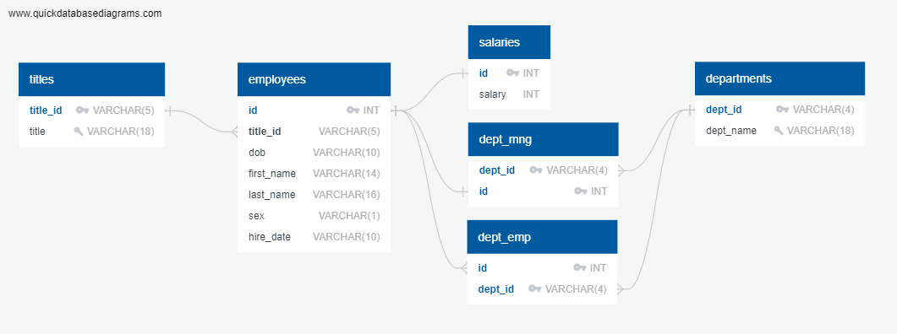

### sql-challenge
# Pewlett Hackard Historic Employee Database
## Data Modeling
Existing data was provided to us in six csv files. 
These files were imported into a [Jupyter Notebook](chk_data.ipynb) in order to determine the contents of the data. 
By doing so we are able to determine datatypes and datatype lengths as relevant for each data set. 
as well as perform some data validation to determine how to assign restrictions for data engineering.

## Data Engineering
 
(Diagram above was created using QuickDBD)
### [Schemata](sql/schemas.sql) 
After looking at the data contained in the csv files and determining the data structure of each file, 
we used QuickDBD to quickly represent each data set and map out the relational structure between them, 
and figure out what columns we should assign the constraints primary key, foreign key, and unique. 
With that information, we were created the schemata in VScode to be imported into pgAdmin.

## Data Analysis
### [Queries](sql/queries.sql)
After creating a database in pgAdmin, we created tables using the schemata and imported each csv file 
into it's corresponding table in an appropriate order based on the relationships between each table. 
Once the database was setup, we were able to create queries to create the following lists:
- List the employee number, last name, first name, sex, and salary of each employee.
- List the first name, last name, and hire date for the employees who were hired in 1986.
- List the manager of each department along with their department number, department name, employee number, last name, and first name.
- List the department number for each employee along with that employee’s employee number, last name, first name, and department name.
- List first name, last name, and sex of each employee whose first name is Hercules and whose last name begins with the letter B.
- List each employee in the Sales department, including their employee number, last name, and first name.
- List each employee in the Sales and Development departments, including their employee number, last name, first name, and department name.
- List the frequency counts, in descending order, of all the employee last names (that is, how many employees share each last name) 

## Resources
QuickDBD: Quick Database Diagrams 
http://www.quickdatabasediagrams.com/
